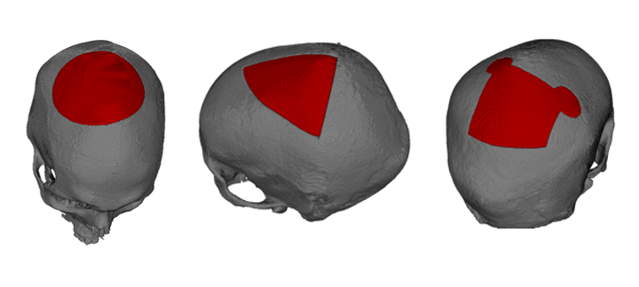

# 3D U-Net Convolution Neural Network

[[Update August 2022 - data loading is now 10x faster!](doc/Changes.md)]

* [Tutorials](#tutorials)
* [Introduction](#introduction)
* [Quick Start Guide](#quickstart)
  * [Installation](#installation)
  * [Configuration](#configuration)
  * [Training](#training)
  * [Inference](#inference)
  * [Evaluation](#evaluation)
* [Documentation](#documentation)
* [Citation](#citation)


## Tutorials <a name="tutorials"></a>
### [Brain Tumor Segmentation (BraTS 2022)](examples/brats2020)
[](examples/brats2020)
### [Anatomical Tracings of Lesions After Stroke (ATLAS 2.0)](examples/atlas_2022)
[](examples/atlas2022)
### [Automatic Cranial Implant Design (AutoImpant 2020)](examples/autoimplant2020)
[](examples/autoimplant2020)

## Introduction <a name="introduction"></a>
We designed 3DUnetCNN to make it easy to apply and control the training and application of various deep learning models to medical imaging data.
The links above give examples/tutorials for how to use this project with data from various MICCAI challenges.


## Quick Start Guide <a name="quickstart"></a>
How to train a UNet on your own data.

### Installation <a name="installation"></a>
1. Clone the repository:<br />
```git clone https://github.com/ellisdg/3DUnetCNN.git``` <br /><br />

2. Install the required dependencies<sup>*</sup>:<br />
```pip install -r 3DUnetCNN/requirements.txt``` 

<sup>*</sup>It is highly recommended that an Anaconda environment or a virtual environment is used to 
manage dependcies and avoid conflicts with existing packages.

### Setup the configuration file <a name="configuration"></a>
1. Copy the default configuration file: <br />
```cp examples/default_config.json <your-default_config>.json```<br /><br />
2. Add the ```training_filenames``` and ```validation_filenames``` for your dataset to the configuration file.
<br /><br />
Example:<br />
```"training_filenames": [[["sub01/t1w.nii.gz", "sub01/t2w.nii.gz"], "sub01/labelmap.nii.gz"], ...]```
<br />
Where ```["sub01/t1w.nii.gz", "sub01/t2w.nii.gz"]``` is the set of input filenames for single subject, 
```"sub01/labelmap.nii.gz"``` is the labelmap filename for that subject. This should be repeated for all the subjects in the dataset.
It is probably easiest to add these filenames using a Python script.<br /><br />
3. (optional) Change model and training configuration settings as desired. (see [Configuration File Guide](doc/Configuration.md))

### Train the model <a name="training"></a>
Run the model training:<br />
```3DUnetCNN/scripts/train.py ...```

### Predict Validation Cases <a name="inference"></a>
Run model inference on the ```validation_filenames```:<br />
```3DUnetCNN/scripts/predict.py ...```

### Evaluate Results <a name="evaluation"></a>
```3DUnetCNN/scripts/evaluate.py ...```

## Documentation <a name="documentation"></a>
* [Configuration Guide](doc/Configuration.md)
* [Frequently Asked Questions](doc/FAQ.md)

### Still have questions? <a name="questions"></a>
Once you have reviewed the documentation, feel free to raise an issue on GitHub, or email me at david.ellis@unmc.edu.

## Citation <a name="citation"></a>
Ellis D.G., Aizenberg M.R. (2021) Trialing U-Net Training Modifications for Segmenting Gliomas Using Open Source Deep Learning Framework. In: Crimi A., Bakas S. (eds) Brainlesion: Glioma, Multiple Sclerosis, Stroke and Traumatic Brain Injuries. BrainLes 2020. Lecture Notes in Computer Science, vol 12659. Springer, Cham. https://doi.org/10.1007/978-3-030-72087-2_4

### Additional Citations
Ellis D.G., Aizenberg M.R. (2020) Deep Learning Using Augmentation via Registration: 1st Place Solution to the AutoImplant 2020 Challenge. In: Li J., Egger J. (eds) Towards the Automatization of Cranial Implant Design in Cranioplasty. AutoImplant 2020. Lecture Notes in Computer Science, vol 12439. Springer, Cham. https://doi.org/10.1007/978-3-030-64327-0_6

Ellis, D.G. and M.R. Aizenberg, Structural brain imaging predicts individual-level task activation maps using deep learning. bioRxiv, 2020: https://doi.org/10.1101/2020.10.05.306951
